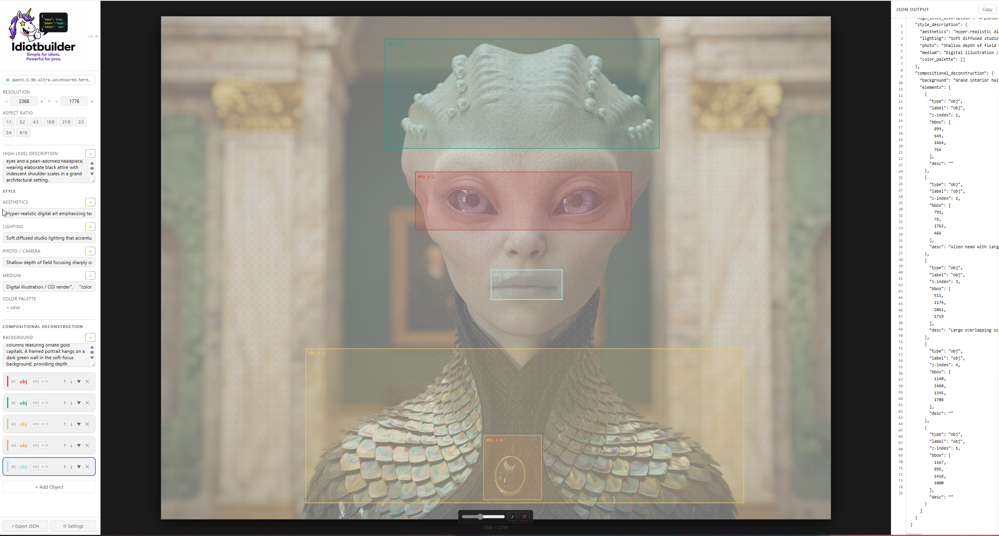

# Idiotbuilder v1.0

**Simple for idiots. Powerful for pros.**

A visual JSON prompt builder for [Ideogram](https://ideogram.ai)'s compositional deconstruction feature. Draw bounding boxes on a canvas, assign z-indices, descriptions, and colour palettes to each element, then export a structured JSON prompt — ready to drop into your LLM workflow.



---

## Features

### Canvas
- **Visual bounding boxes** — click and drag to draw bboxes; all coordinates update the JSON live
- **Reference image overlay** — import any image as a faded canvas backdrop for precision layout; opacity slider to fade it in/out; auto-detects image dimensions and snaps the resolution to match
- **Aspect ratio presets** — 1:1, 3:2, 4:3, 16:9, 21:9, 2:3, 3:4, 9:16 with manual width/height controls

### Objects & Elements
- **obj** type — standard compositional element with label, z-index, bbox, description, colour palette, and custom key-value properties
- **text** type — text localisation element; exports as `TEXT: 'content' desc bbox=[x,y,x,y]` in 1000×1000 normalised coordinates, exactly matching LLM output format
- **Per-element colour palette** — hex colour swatches per object, rendered as `string[]` in JSON
- **Reorder & delete** — move objects up/down the z-stack; remove with one click

### Style & Description
- **High-level description** — scene-wide narrative field
- **Style description** — Aesthetics, Lighting, and Photo/Camera fields for granular control
- **Medium** — artwork medium field
- **Global colour palette** — top-level palette applied to the whole composition

### LM Studio Integration
- **Connection indicator** — live status dot + active model name in the sidebar; click it to open settings
- **Auto-detect model** — detects available models from your LM Studio server automatically
- **Rephrase buttons** — on every text field; each button uses a field-specific system prompt for context-aware rewrites
- **Rainbow rephrase button** — animated gradient border that spins on hover (important feature)

### JSON Panel
- **Live editable JSON** — the right panel shows the full Ideogram JSON with line numbers; click any line and edit it directly; changes sync back to the sidebar in real-time
- **Debounced parse** — edits are parsed 400ms after you stop typing; invalid JSON reverts on blur
- **Copy button** — one click to copy the full JSON to clipboard
- **Save / Open** — native file dialogs to save and reload `.json` prompt files

### General
- **Persistent state** — your work survives app restarts (localStorage)
- **88 tests** — full test coverage of all store actions, JSON builder/parser round-trips, and hook integration

---

## JSON Output Format

```json
{
  "high_level_description": "A dramatic moonlit cityscape...",
  "style_description": {
    "aesthetics": "noir, cinematic",
    "lighting": "high contrast moonlight",
    "photo": "35mm film, shallow depth of field",
    "medium": "digital painting",
    "color_palette": ["#0a0a1a", "#c8a96e"]
  },
  "compositional_deconstruction": {
    "background": "Dark storm clouds over a neon-lit city skyline",
    "elements": [
      {
        "type": "obj",
        "label": "figure",
        "z-index": 2,
        "bbox": [120, 300, 450, 900],
        "desc": "A lone detective in a trench coat",
        "color_palette": ["#1a1a2e", "#c8a96e"]
      },
      {
        "type": "obj",
        "label": "title",
        "z-index": 3,
        "desc": "TEXT: 'NIGHT CITY' Bold serif title at the top. bbox=[200,50,800,150]"
      }
    ]
  }
}
```

---

## Getting Started

### Prerequisites

- [Node.js](https://nodejs.org) 18+
- [Rust](https://rustup.rs) (for the Tauri backend)
- [Tauri v2 prerequisites](https://v2.tauri.app/start/prerequisites/) for your OS

### Install & run

```bash
git clone https://github.com/Fablestarexpanse/idiotbuilder.git
cd idiotbuilder
npm install
npm run tauri dev
```

### Build a release binary

```bash
npm run tauri build
```

The installer is output to `src-tauri/target/release/bundle/`.

---

## LM Studio Setup (optional)

Idiotbuilder can rephrase descriptions using a locally running [LM Studio](https://lmstudio.ai) server.

1. Start LM Studio and load any model
2. Enable the local server (default port 1234)
3. In the app click the connection indicator in the sidebar (or **⚙ Settings**)
4. Hit **Auto-detect** to pick up the active model automatically

---

## Tech Stack

| Layer | Tech |
|-------|------|
| Desktop shell | [Tauri 2](https://tauri.app) |
| UI framework | React 18 + TypeScript |
| Build tool | Vite |
| State | Zustand (with localStorage persistence) |
| Colour picker | @uiw/react-color |
| HTTP (LM Studio) | reqwest (Rust) |
| Tests | Vitest + Testing Library |

---

## License

MIT
